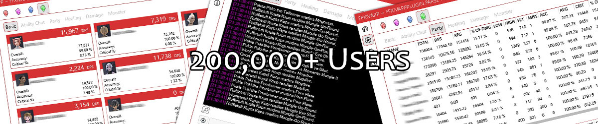

# About

This is the latest release of main application; the memory offsets are updated on each patch by the community:

# Notice

I'm getting out of the development process for FFXIV. I have the following domains. Does anyone want to take them over?

- [XIVCHAT](https://xivchat.com)
- [XIVLOGS](https://xivlogs.com)
- [XIVMARKET](https://xivmarket.com)
- [XIV-MARKET](https://xiv-market.com)
- [FFXIVAPP](https://ffxivapp.com)
- [FFXIV-APP](https://ffxiv-app.com)

You can contact me via GitHub (email on profile) or [Twitter](https://twitter.com/SyndicatedLife)

# Installation

# Plugins

## Chat

[{: .image-left .image-box .image-64 }](/plugins/chat/)
Tired of using remote desktop or other viewing software to talk with your friends in-game?

Use your phone, tablet or PC anywhere in the world to talk with anyone in the game.

## Event

[{: .image-left .image-box .image-64 }](/plugins/event/)
The event plugin is highly tuned to provide a customized experience and notification system based on chat line events from the game.

It allows the user to make events that can use TTS, program execution and sound files.

## Log

[{: .image-left .image-box .image-64 }](/plugins/log/)
The log plugin has it's humble beginnings back in XI and now is working with Final Fantasy XIV.

Many users each day use the translation aspect of this feature to localize parts of the game so they may enjoy more cross-culture experiences.

## Parse

[{: .image-left .image-box .image-64 }](/plugins/parse/)
This is among one of the most used parsers for Final Fantasy XIV and was for quite some time the only one actively being developed.

It provides real-time data, is open source and presented in a way that is usable and friendly. It's been used since Beta of 1.0 and is always evolving.

## Radar

[{: .image-left .image-box .image-64 }](/plugins/radar/)
The radar plugin was inspired by ApRadar in XI and has since become a key plugin used by many people. It's especially helpful in locating hard to find NPC's during quests.

It can also be used to find just about anything you are looking for on the map with Z depth rendering of names. Bigger is above you, smaller is below.

## Widgets

[{: .image-left .image-box .image-64 }](/plugins/widgets/)
The widgets plugin really showcases how UI elements can be rendered and usable in a small form factor.

It is very extensible and can be customized.

